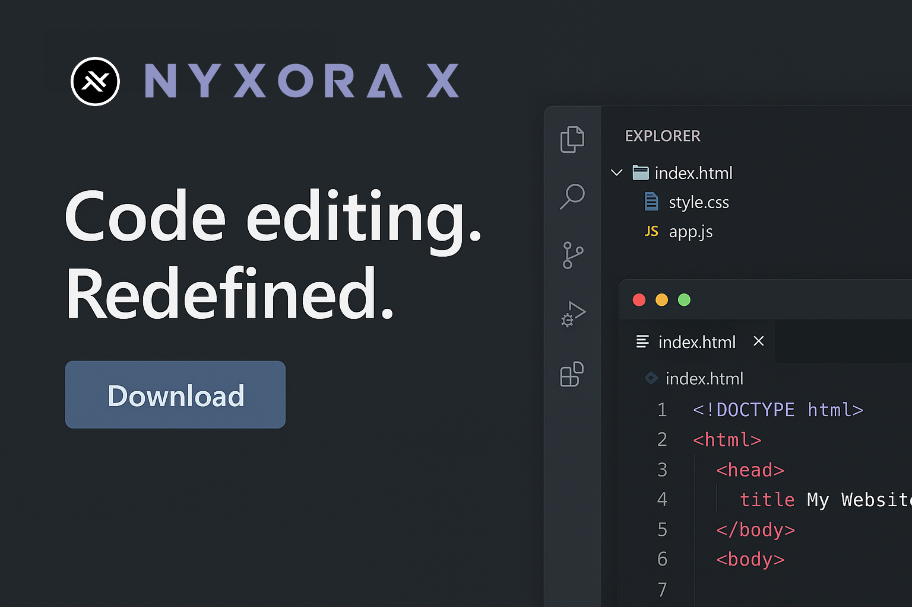

# NyxoraX-AI

<div align="center">



<h2>COMING SOON</h2>

*An innovative AI-powered platform designed to revolutionize digital experiences.*  
*Professional-grade artificial intelligence solutions in development.*

</div>

---

## Core Features

| **AI Intelligence** | **Innovation** | **Precision** |
|:---:|:---:|:---:|
| Advanced machine learning algorithms | Cutting-edge technological solutions | High-accuracy data processing |
| Neural network optimization | Modern architecture patterns | Tailored user experiences |

---

## Development Roadmap

```
Phase 1: Foundation          [IN PROGRESS]
├── Core architecture design
├── System infrastructure
└── Base framework implementation

Phase 2: Integration         [PLANNED]
├── AI model integration
├── Feature development
└── Performance optimization

Phase 3: Deployment          [UPCOMING]
├── Beta testing
├── Public release
└── Community engagement
```

---

## Project Status

<div align="center">

```
[████████████████████████████████████] 100%
```

**Current Status:** *Development in Progress*

**Expected Release:** *Q3 2025*

</div>

---

## Get Notified

<div align="center">

**Star this repository to receive updates when NyxoraX-AI launches**

[Follow Development Progress](../../) • [Documentation](../../wiki) • [Issues](../../issues)

</div>

---

<div align="center">

```
N Y X O R A X - A I
```

*Professional AI Solutions*

---

<sub>© 2025 NyxoraX-AI Development Team</sub>

</div>