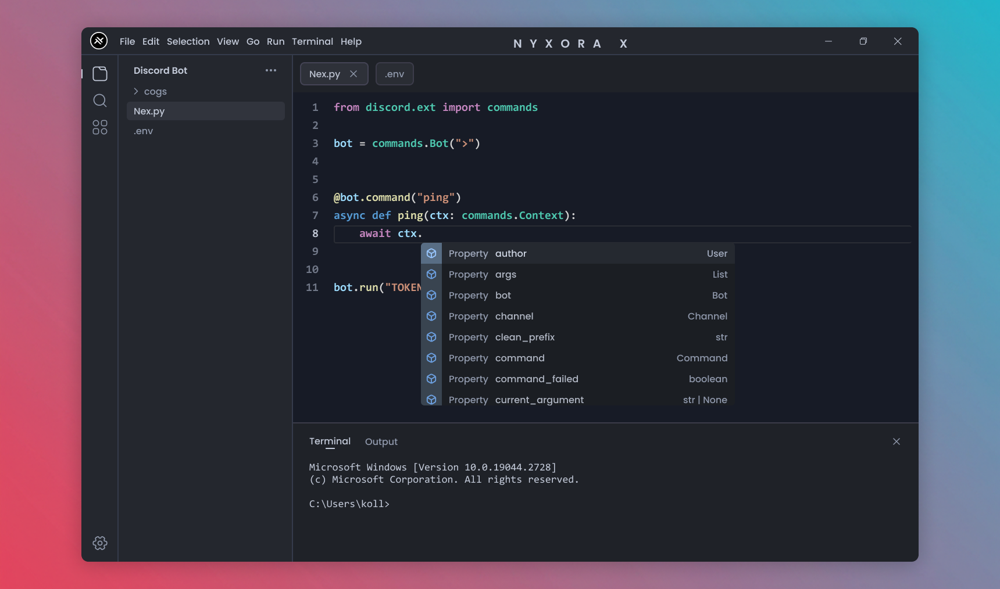

# NyxoraX AI Code Editor

> Next-generation AI-powered development environment

[](https://opensource.org/licenses/MIT)
[](https://github.com/ZERO-DAWN-X/NyxoraX)
[](https://github.com/ZERO-DAWN-X/NyxoraX)
[](https://github.com/ZERO-DAWN-X/NyxoraX)


## Overview

**NyxoraX** combines Visual Studio Code with cutting-edge AI capabilities to revolutionize your development experience. Built for developers who demand excellence in their coding environment.



### Key Highlights

- Intelligent code completion
- Automated error detection  
- Natural language programming
- Modern glass morphism UI
- Multiple visual themes

## Features

### AI-Powered Development

**Smart Code Completion**  
Context-aware suggestions that understand your code patterns and project structure

**Intelligent Error Analysis**  
Real-time error detection with AI-powered solutions and performance optimization

**Natural Language Coding**  
Write code using plain English descriptions and let AI generate the implementation

### Enhanced Development Experience

- **Glass Morphism UI** - Modern, elegant interface design
- **Multiple Themes** - Professional, Gaming, and Light themes  
- **Lightning Performance** - Optimized for speed and efficiency
- **Real-time Collaboration** - Seamless team development
- **VS Code Compatible** - Familiar environment with enhanced features

## Quick Start

### Installation

```bash
# Clone the repository
git clone https://github.com/ZERO-DAWN-X/NyxoraX.git

# Navigate to project directory
cd NyxoraX/vscode

# Install dependencies
npm install

# Build the editor
npm run compile

# Launch NyxoraX
npm run watch
```

### System Requirements

- **Node.js** 16.0 or higher
- **npm** 7.0 or higher
- **Git** for version control
- **4GB RAM** minimum, 8GB recommended

## Visual Themes

Choose your perfect development environment from our carefully crafted themes:

### Professional Theme


*Clean, elegant design perfect for business development and corporate environments*

### Gaming Theme


*Vibrant, energetic colors designed for creative coding and game development*

## Developer

**ZERO-DAWN-X** - AI Developer & Innovation Architect

*Vision:* Creating intelligent development tools that amplify human creativity and productivity through the power of artificial intelligence.

**Core Expertise:**

- AI & Machine Learning Integration
- Modern UI/UX Design Principles
- Performance Optimization  
- Developer Experience Enhancement

**Philosophy:** *"Code should be intuitive, powerful, and beautiful"*

## Community & Support

### Get Involved

- **Star the repository** to show your support
- **Report bugs** and suggest new features via GitHub Issues
- **Join discussions** to connect with other developers
- **Contribute code** through pull requests

[](https://discord.gg/nyxorax)
[](https://github.com/ZERO-DAWN-X/NyxoraX/discussions)
[](https://github.com/ZERO-DAWN-X/NyxoraX/issues)

## Contributing

We welcome contributions from the community! Here's how to get started:

1. **Fork** the repository
2. **Create** a feature branch (`git checkout -b feature/amazing-feature`)
3. **Commit** your changes (`git commit -m 'Add amazing feature'`)
4. **Push** to the branch (`git push origin feature/amazing-feature`)
5. **Open** a Pull Request

### Development Guidelines

- Follow the existing code style and conventions
- Write clear, descriptive commit messages  
- Include tests for new features
- Update documentation as needed
- Ensure all tests pass before submitting

## License

This project is licensed under the MIT License - see the [LICENSE](LICENSE.txt) file for details.

## Acknowledgments

- Built on the foundation of Visual Studio Code
- Powered by cutting-edge AI technologies
- Inspired by the developer community's needs
- Designed with modern web standards

---

**© 2025 ZERO-DAWN-X** | **MIT License** | **Powered by AI** | **Designed for Developers**

*Thank you for your interest in NyxoraX AI Code Editor. Together, we're building the future of intelligent development.*
