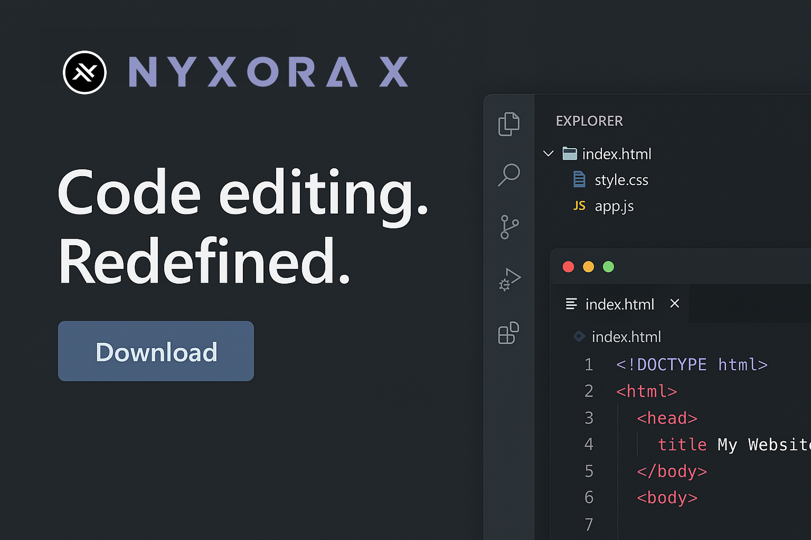

<div align="center">

# NyxoraX AI Code Editor

*Next-generation AI-powered development environment*

[](https://opensource.org/licenses/MIT)
[](https://github.com/ZERO-DAWN-X/NyxoraX)



</div>

---

## Overview

NyxoraX combines Visual Studio Code with advanced AI capabilities, delivering intelligent code completion, automated error detection, and natural language programming support for modern developers.

<div align="center">
  
</div>

---

## Core Features

<div align="center">

### **AI Intelligence**
Context-aware code completion and generation  
Smart error detection with automated fixes

### **Modern Interface**  
Dual theme system with glass morphism design  
Customizable workspace and responsive layout

### **Performance**
Lightning-fast execution with memory optimization  
Real-time collaboration and VS Code compatibility

</div>

---

## Quick Start

```bash
# Clone and setup
git clone https://github.com/ZERO-DAWN-X/NyxoraX.git
cd NyxoraX/vscode
npm install

# Build and run
npm run compile
npm run watch
```

---

## Themes

<div align="center">

<table>
<tr>
<td align="center">

<br><strong>Professional</strong>
<br><em>Clean, elegant design</em>
</td>
<td align="center">

<br><strong>Gaming</strong>
<br><em>Vibrant, energetic colors</em>
</td>
</tr>
</table>

</div>

---

## Contributing

1. Fork the repository
2. Create feature branch (`git checkout -b feature/name`)
3. Commit changes (`git commit -m 'Add feature'`)
4. Push branch (`git push origin feature/name`)
5. Open Pull Request

---

<div align="center">

**Built by ZERO-DAWN-X**

[](https://github.com/ZERO-DAWN-X)
[](https://github.com/ZERO-DAWN-X/NyxoraX)

<sub>MIT License | Powered by AI | Designed for Developers</sub>

</div>

<style>
@keyframes fadeIn {
  from { opacity: 0; transform: translateY(20px); }
  to { opacity: 1; transform: translateY(0); }
}

@keyframes slideIn {
  from { opacity: 0; transform: translateX(-30px); }
  to { opacity: 1; transform: translateX(0); }
}

@keyframes pulse {
  0%, 100% { transform: scale(1); opacity: 1; }
  50% { transform: scale(1.05); opacity: 0.8; }
}

h1, h2, h3 {
  animation: fadeIn 1s ease-out;
}

img {
  animation: slideIn 1.2s ease-out;
  transition: transform 0.3s ease;
}

img:hover {
  transform: scale(1.02);
}

.badge {
  animation: pulse 2s infinite;
}
</style>
