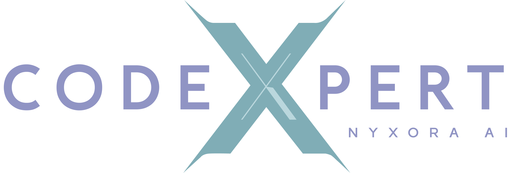
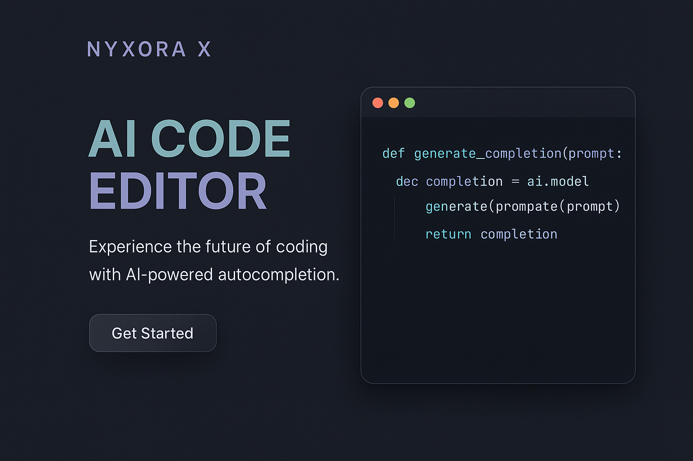
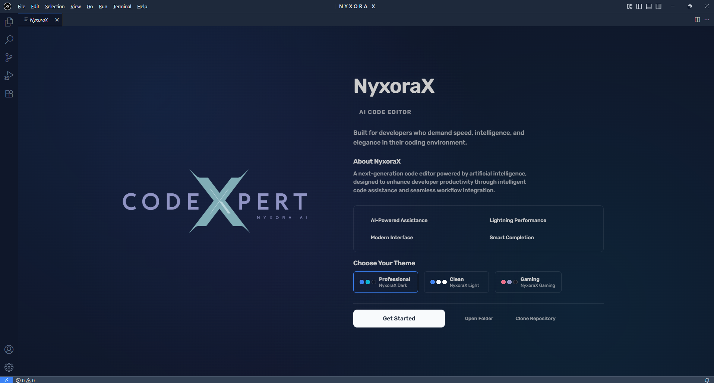
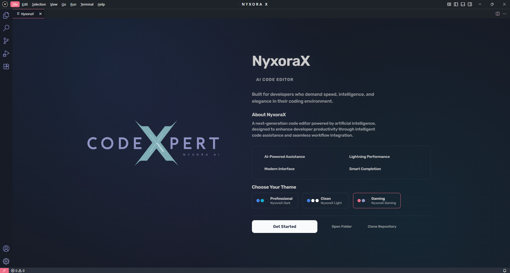
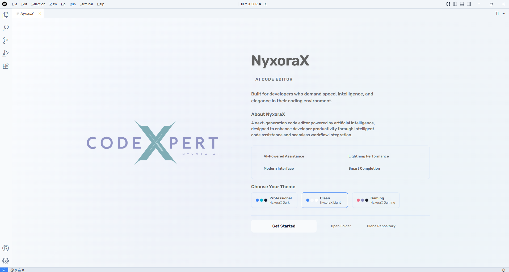

<div align="center">

# NyxoraX AI Code Editor

*Next-generation AI-powered development environment*

[](https://opensource.org/licenses/MIT)
[](https://github.com/ZERO-DAWN-X/NyxoraX)



</div>

---

## Overview

NyxoraX combines Visual Studio Code with advanced AI capabilities, delivering intelligent code completion, automated error detection, and natural language programming support for modern developers.

<div align="center">
  
</div>

---

## Why Choose NyxoraX?

<div align="center">

*Revolutionary AI meets elegant design to transform your coding experience*

</div>

### **Advanced AI Capabilities**

<table align="center">
<tr>
<td align="center" width="33%">
<h4>🧠 Smart Completion</h4>
<p>Context-aware suggestions that understand your code patterns and project structure</p>
</td>
<td align="center" width="33%">
<h4>🔍 Intelligent Analysis</h4>
<p>Real-time error detection with AI-powered solutions and performance optimization</p>
</td>
<td align="center" width="33%">
<h4>💬 Natural Language</h4>
<p>Write code using plain English descriptions and let AI generate the implementation</p>
</td>
</tr>
</table>

### **Professional Development Experience**

<div align="center">

| Feature | Description | Benefit |
|:-------:|:-----------:|:-------:|
| **Glass Morphism UI** | Modern translucent design with blur effects | Enhanced visual appeal |
| **Dual Theme System** | Professional & Gaming modes | Personalized workspace |
| **Lightning Performance** | Optimized rendering and memory management | Faster development |
| **Real-time Collaboration** | Built-in team coding features | Seamless teamwork |
| **VS Code Compatible** | Full extension ecosystem support | Familiar environment |

</div>

---

## Quick Start

```bash
# Clone and setup
git clone https://github.com/ZERO-DAWN-X/NyxoraX.git
cd NyxoraX/vscode
npm install

# Build and run
npm run compile
npm run watch
```

---

## Themes

<div align="center">

<table>
<tr>
<td align="center">

<br><strong>Professional</strong>
<br><em>Clean, elegant design</em>
</td>
<td align="center">

<br><strong>Gaming</strong>
<br><em>Vibrant, energetic colors</em>
</td>
<td align="center">

<br><strong>Light</strong>
<br><em>Bright, minimalist interface</em>
</td>
</tr>
</table>

</div>

---

## Meet the Developer

<div align="center">


### **ZERO-DAWN-X**
*AI Developer & Innovation Architect*

</div>

**Vision:** Creating intelligent development tools that amplify human creativity and productivity through the power of artificial intelligence.

<div align="center">

**Expertise**
- AI & Machine Learning Integration
- Modern UI/UX Design Principles  
- Performance Optimization
- Developer Experience Enhancement

**Philosophy:** *"Code should be intuitive, powerful, and beautiful"*

</div>

---

## Community & Support

<div align="center">

### Join Our Growing Community

[](https://discord.gg/nyxorax)
[](https://github.com/ZERO-DAWN-X/NyxoraX/discussions)
[](https://github.com/ZERO-DAWN-X/NyxoraX/issues)

**🌟 Star the repo** • **🐛 Report bugs** • **💡 Suggest features** • **🤝 Contribute code**

</div>

---

## Contributing

1. Fork the repository
2. Create feature branch (`git checkout -b feature/name`)
3. Commit changes (`git commit -m 'Add feature'`)
4. Push branch (`git push origin feature/name`)
5. Open Pull Request

---

<div align="center">

### **NyxoraX AI Code Editor**

**Built with ❤️ by ZERO-DAWN-X**

[](https://github.com/ZERO-DAWN-X)
[](https://github.com/ZERO-DAWN-X/NyxoraX)
[](LICENSE.txt)

---

**🚀 The Future of Intelligent Development**

*Where Artificial Intelligence meets Human Creativity*

---

**© 2025 ZERO-DAWN-X** | **MIT License** | **Powered by AI** | **Designed for Developers**

</div>

<style>
@keyframes fadeIn {
  from { opacity: 0; transform: translateY(20px); }
  to { opacity: 1; transform: translateY(0); }
}

@keyframes slideIn {
  from { opacity: 0; transform: translateX(-30px); }
  to { opacity: 1; transform: translateX(0); }
}

@keyframes slideUp {
  from { opacity: 0; transform: translateY(30px); }
  to { opacity: 1; transform: translateY(0); }
}

@keyframes pulse {
  0%, 100% { transform: scale(1); opacity: 1; }
  50% { transform: scale(1.05); opacity: 0.8; }
}

@keyframes glow {
  0%, 100% { box-shadow: 0 0 5px rgba(102, 126, 234, 0.5); }
  50% { box-shadow: 0 0 20px rgba(102, 126, 234, 0.8), 0 0 30px rgba(102, 126, 234, 0.6); }
}

@keyframes float {
  0%, 100% { transform: translateY(0px); }
  50% { transform: translateY(-5px); }
}

h1 {
  animation: fadeIn 1.2s ease-out;
  color: #2c3e50;
}

h2 {
  animation: slideIn 1s ease-out;
  color: #34495e;
}

h3 {
  animation: slideUp 0.8s ease-out;
  color: #2980b9;
}

img {
  animation: slideIn 1.2s ease-out;
  transition: all 0.3s ease;
}

img:hover {
  transform: scale(1.05) rotate(2deg);
  filter: brightness(1.1);
}

table {
  animation: fadeIn 1.5s ease-out;
}

.badge {
  animation: pulse 2s infinite;
}

.gradient-box {
  animation: glow 3s ease-in-out infinite alternate;
}

code {
  background: linear-gradient(135deg, #f5f7fa 0%, #c3cfe2 100%);
  padding: 2px 6px;
  border-radius: 4px;
  font-family: 'Courier New', monospace;
}

blockquote {
  border-left: 4px solid #3498db;
  padding-left: 20px;
  margin: 20px 0;
  background: rgba(52, 152, 219, 0.1);
  border-radius: 5px;
}
</style>
